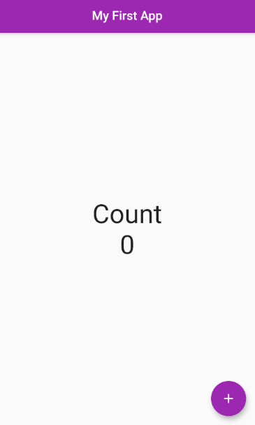

<h1 align="center" style="text-align:center;font-family: Bahnschrift Condensed; font-size:35px;">
Simple Counter
</h1>
<h1 align="center" style="text-align:center">
<p style="font-family: Bahnschrift Condensed; font-size:35px;">👀 PREVIEW</p>

</h1>

## 📕 Index

- [About](#-about)

- [Technologies](#-technologies)

- [How to download the project](#-how-to-download-the-project)

---

## 📜 About

The **Simple Counter** is that was developed in the first class of NLW Together event. Its purpose was to put the main concepts of Flutter to test and create a simple application.

---

## 🚀 Technologies

- [Dart](https://dart.dev/)
- [Flutter](https://flutter.dev/)
- [MaterialApp](https://flutter.dev/docs/development/ui/widgets/material)

---

## 📦 How to download the project

```bash
# Clone the repository

$ git clone https://github.com/harlleybastos/flutter-simple-count.git

# Enter in the repository

$ cd flutter-simple-count

# Install the dependencies

$ yarn install

# Initialize the project

$ yarn start

# And DONE ! :)

```

Developed by Harlley dos Santos Bastos 😁🚀
